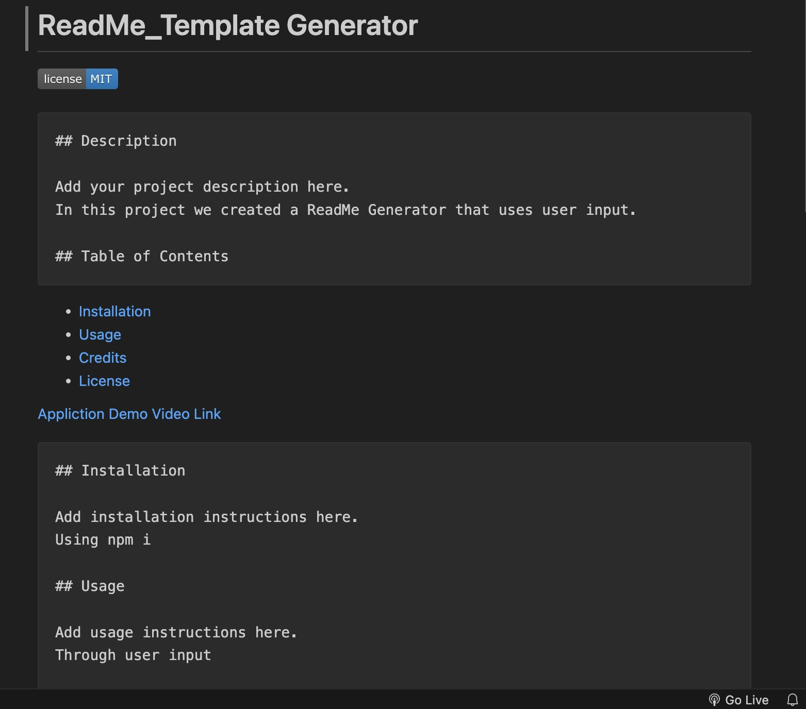

# readme-generator

## Technology Used 

| Technology Used | Resource URL | 
| ------------- |:-------------:| 
| HTML | [https://developer.mozilla.org/en-US/docs/Web/HTML](https://developer.mozilla.org/en-US/docs/Web/HTML) | 
| CSS | [https://developer.mozilla.org/en-US/docs/Web/CSS](https://developer.mozilla.org/en-US/docs/Web/CSS) | 
| Git | [https://git-scm.com/](https://git-scm.com/) | 

## Description 
In this project I created a weather web application displaying a 5 day forecast for a given city with the ability to recall past searches for display from local storage.

## Code Example 

 

This project wasn't quite as difficult as past challenges, but it was far from simple, I understood what was required, but remembering how to link the files properly was something I had to get use to and commit to memory. 

// TODO: Create a function that returns a license badge based on which license is passed in
// If there is no license, return an empty string 
function renderLicenseBadge(license) {
  if (license !== 'None') {
    return ``;

  }
  return "";
}

// TODO: Create a function that returns the license link
// If there is no license, return an empty string - almost done
function renderLicenseLink(license) {
  if (license !== 'None') {
    return `- [License](#license)`;

  }
  return "";
}

// TODO: Create a function that returns the license section of README
// If there is no license, return an empty string
function renderLicenseSection(license) {
  if (license !== 'None') {
    return `## License`;

  }
  return "";
}

I was blown away by how simple this code was meant to be when I sat down with my tutor. I had at least 10 lines of code per function, that I ended up deleting and replacing with around 5 or 6 codes instead. It has become the theme of my coding learning experience: "Keep It Simple."

## Learning Points 

I learned a great deal about using node.js throughout the course of this project. It was a learning curve at first but I slowly but surely began to wrap my mind around the concept the more I endeavored to build this application. Learning to reference additional JavaScript files together so that information was shared between them was an interesting new concept, one that I think I need to continue practicing in the future to get a tighter grasp on the idea.

## Author Info
Armand Araujo
Age: 28
Location: Santa Barbara, CA

 
* [LinkedIn](https://www.linkedin.com/in/armand-araujo-a82ba2291/) 
* [Github](https://github.com/Armand57araujo) 

## Credits 